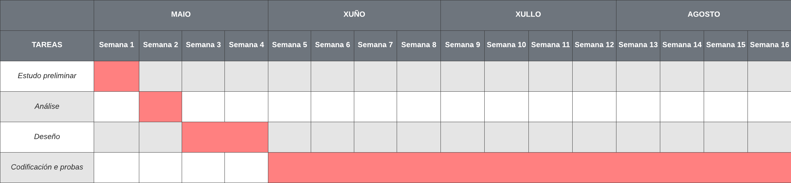

# Planificación

## Metodoloxía prevista
Debido ao tamaño do proxecto é ao tempo que finalmente tiven dispoñible para o desenvolvemento, sigueuse un tipo de metodoloxía clásica (ou "Waterfall"). Desenvolveuse a aplicación etapa a etapa de forma lineal de forma que non ata que non se remataba unha fase non se comezaba a seguinte.

## Fases planificadas

Descríbense as fases en que se divide o proxecto.
Pódense indicar os recursos materiais e humanos asociados a cada tarefa ou, se son os mesmos, de maneira máis xeral.

#### Fase 1: Estudo preliminar

Tarefa 1| Idea do proxecto
-|-
Descrición| Definir en qué consistirá a aplicación
Recursos hardware/software| Ordenador persoal con conexión a internet e navegador web
Recursos humanos| Programador junior
Duración| 1 día

Tarefa 2| Estudo preliminar
-|-
Descrición| Estudar as necesidades do proxecto, audiencia, modelo de negocio e requerimentos
Recursos hardware/software| Ordenador persoal con conexión a internet e navegador web
Recursos humanos| Programador junior
Duración| 6 días

...

#### Fase 2: Requerimentos do sistema (análise)

Tarefa 1| Requerimentos funcionais
-|-
Descrición| Definición dos requerimentos para Crypfolio, estudo de funcionalidades a incluír
Recursos hardware/software| Ordenador persoal con conexión a internet e navegador web
Recursos humanos| Programador junior
Duración| 2 días

Tarefa 2| Requerimentos de HW e SW
-|-
Descrición| Definición do software e hardware que serán necesarios para o desenvolvemento da app. Valoración das tecnoloxías máis apropiadas para realizala.
Recursos hardware/software| Ordernador persoal con conexión a internet e navegador web
Recursos humanos| Programador junior
Duración| 5 días

...

#### Fase 3: Deseño

Tarefa 1| Deseño do front-end
-|-
Descrición| Definición do deseño da aplicación, tanto de funcionalidades como das interfaces que permitirán o uso destas.
Recursos hardware/software| Ordenador persoal con conexión a internet e navegador web.
Recursos humanos| Programador junior
Duración| 7 días

Tarefa 2| Deseño do back-end e bbdd
-|-
Descrición| Definición da estructura a realizar tanto para o back-end en Java como para a base de datos.
Recursos hardware/software| Ordenador persoal con conexión a internet e navegador web
Recursos humanos| Programador junior
Duración| 7 días

...

#### Fase 4: Execución

Tarefa 1| Codificación e probas
-|-
Descrición| Codificación tanto do front-end como do back-end e da base de datos coas respectivas probas e tests nada máis incluir un novo cambio.
Recursos hardware/software| Ordenador persoal con conexión a internet, navegador web, VS Code, Eclipse, MySQL, PhpMyAdmin, Angular 12, SASS, HTML, Spring Boot, Spring Security, JWT, Java Postman, XAMPP.
Recursos humanos| Programador junior
Duración| 46 días

Tarefa 2 | Desplegue
-|-
Descrición | Desplegue nun servidor da aplicación web
Recursos hardware/software |  Servidor VPS Windows Server 2016 con servidor web IIS para servir o front-end e Tomcat para desplegar o ".war" do backend
Recursos humanos | Programador junior
Duración | 3 días

## Calendario

